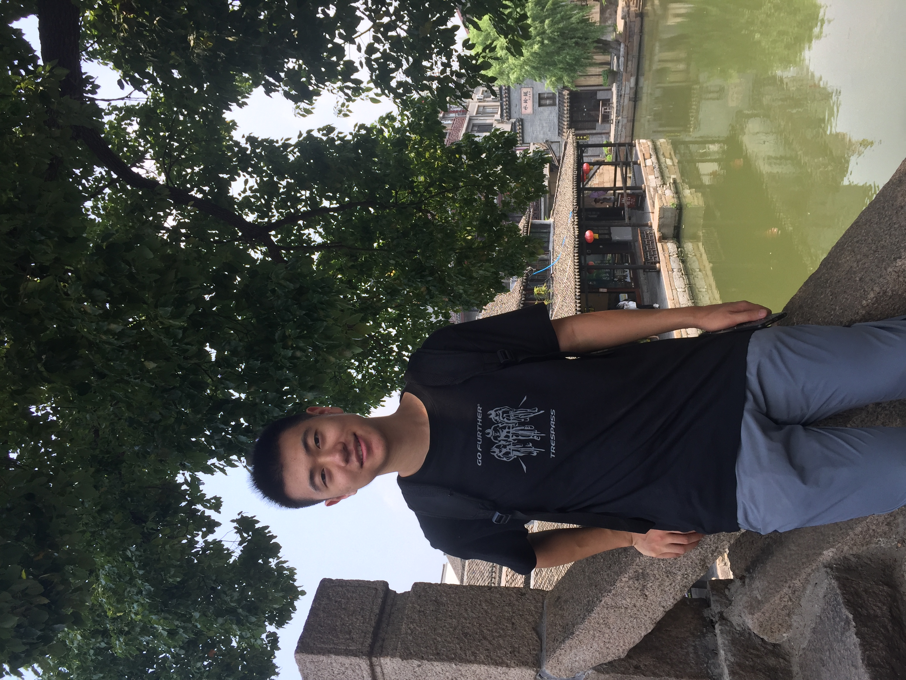

I am a first year Ph.D. student in information at University of Arizona. My advisor is Peter Jansen. I received my master degree in computer science from University of Michigan and my undergraduate degree in microelectronic engineering from Fudan University.

My general research interests are in natural language processing. Specifically, I am interested in question answering and understanding how computer models reason and apply knowledge to answer questions. 

I also had experiences in medical image processing and embedded systems.

Some

### Contact

<i class="svg-icon email"></i>ruoyaowang@email.arizona.edu

<i class="svg-icon github"></i>https://github.com/wsxzwps
